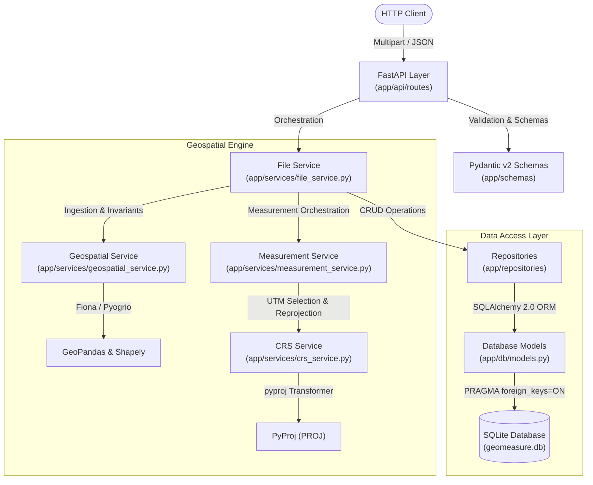

# GeoMeasureAPI — Geospatial File Measurement API

A production-quality REST API built with FastAPI for ingesting geospatial files (`.kml` and `.zip` Shapefiles), extracting geospatial features, inspecting coordinate reference systems (CRS), and computing metric measurements (polygon area and linestring length) using CRS-aware reprojection.

---

## Features

- **Multi-Format Ingestion**: Ingests Google Earth `.kml` and ESRI `.zip` Shapefile archives (requiring `.shp`, `.shx`, and `.dbf` companion files).
- **Secure File Upload Layer**: Streaming file storage with UUID isolation, case-insensitive extension checking, configurable upload size limits (default 50 MB), and path traversal sanitation.
- **Archive Security & Defense-in-Depth**: Zip Slip path traversal mitigation, decompression bomb size limits (default 150 MB), archive member count caps (default 100 entries), and strict single-shapefile enforcement.
- **Geospatial Feature Extraction**: Extracts feature IDs/indices, geometry types, GeoJSON geometry mappings, source CRS strings, and sanitized feature attributes/properties.
- **CRS-Aware Measurement Engine**:
  - Automatically identifies whether source coordinates are geographic (e.g., `EPSG:4326`) or projected.
  - **Zero Degree Calculations**: Strictly prohibits computing area or distance directly on latitude/longitude degree coordinates.
  - Dynamically selects an optimal metric Universal Transverse Mercator (UTM) projected CRS from the dataset bounding box centroid.
  - Converts non-metric projected datasets (e.g., US survey feet) into SI metric units.
  - **Polygon & MultiPolygon**: Calculates surface area in square metres (`m²`).
  - **LineString & MultiLineString**: Calculates linear length in metres (`m`).
  - **Point & MultiPoint**: Explicitly flagged as `NOT_APPLICABLE` without errors.
  - **Missing or Invalid Geometries**: Flagged as `UNAVAILABLE` with clear diagnostic reasons without failing the entire file.
- **Persistent Storage**:
  - Lightweight relational persistence with SQLite and SQLAlchemy 2.0 ORM.
  - Stores file metadata and normalized individual feature measurement rows.
  - Enforces foreign-key constraints (`PRAGMA foreign_keys=ON`) and cascading deletion.
  - Data and measurements persist across complete server shutdowns and restarts.
- **Production Observability & Hardening**:
  - Centralized structured logging for key lifecycle events.
  - Centralized exception handlers preventing stack trace or sensitive path leakage (returns uniform `{ "detail": "..." }`).
  - Strict UUID format validation returning `HTTP 422`.
  - Comprehensive interactive OpenAPI/Swagger documentation.
  - Docker containerization and GitHub Actions CI workflow.

---

## Architecture

The system is built with a clean layered architecture that separates network contracts, domain orchestration, spatial computation, and persistence:



---

## Project Structure

```text
geospatial-measurement-api/
├── .github/
│   └── workflows/
│       └── ci.yml                   # GitHub Actions CI workflow
├── app/
│   ├── __init__.py
│   ├── main.py                      # FastAPI app factory, lifespan, and global exception handlers
│   ├── api/
│   │   ├── __init__.py              # Root API router
│   │   └── routes/
│   │       ├── __init__.py
│   │       ├── files.py             # POST /api/files/, GET /api/files/{id}/, GET /api/files/{id}/measurements/
│   │       └── health.py            # GET /health
│   ├── core/
│   │   ├── __init__.py
│   │   ├── config.py                # Pydantic Settings (environment, limits, DB URL)
│   │   └── exceptions.py            # Domain HTTP exceptions
│   ├── db/
│   │   ├── __init__.py
│   │   ├── base.py                  # SQLAlchemy DeclarativeBase
│   │   ├── database.py              # Engine, sessionmaker, SQLite foreign-key listener, get_db
│   │   └── models.py                # FileModel and MeasurementModel ORM entities
│   ├── models/
│   │   ├── __init__.py
│   │   └── file.py                  # Domain dataclasses (GeoFeature, FeatureMeasurement, FileMeasurementSet)
│   ├── repositories/
│   │   ├── __init__.py
│   │   ├── file_repository.py       # Persistence layer for file records
│   │   └── measurement_repository.py# Persistence layer for feature measurements
│   ├── schemas/
│   │   ├── __init__.py
│   │   ├── files.py                 # Request/response models and ErrorResponse
│   │   └── health.py                # HealthCheck response schema
│   └── services/
│       ├── __init__.py
│       ├── crs_service.py           # CRS analysis, UTM zone calculation, pyproj reprojection
│       ├── file_service.py          # Upload streaming, validation, transaction lifecycle
│       ├── geospatial_service.py    # KML/Shapefile parsing, ZIP extraction, feature normalization
│       └── measurement_service.py   # Metric Polygon area and LineString length engine
├── storage/                         # Local storage directory (git-ignored)
│   ├── geomeasure.db                # SQLite database file
│   └── uploads/                     # On-disk uploaded geospatial files
├── tests/
│   ├── __init__.py
│   ├── conftest.py                  # Pytest fixtures: isolated temp storage and isolated SQLite DB
│   ├── test_e2e_measurements.py     # End-to-end integration tests for measurement API
│   ├── test_files.py                # File upload validation, streaming, and size limits
│   ├── test_geospatial.py           # Geospatial ingestion, KML, Shapefile, CRS, Zip Slip tests
│   ├── test_hardening.py            # Phase 6 hardening tests (UUID 422, security, foreign keys)
│   ├── test_health.py               # Health endpoint tests
│   ├── test_measurements.py         # Precision and edge-case unit tests for geometry measurement
│   └── test_persistence.py          # Persistence, transactional rollback, and restart tests
├── .dockerignore                    # Build context exclusions
├── .env.example                     # Example environment configuration
├── .gitignore                       # Git ignore rules
├── Dockerfile                       # Production container definition
├── pyproject.toml                   # Project metadata and pytest configuration
├── README.md                        # Documentation and user guide
└── requirements.txt                 # Project dependencies
```

---

## Requirements

- **Python**: 3.11 or 3.12
- **C Geospatial Libraries** (required by Fiona / GeoPandas / PyProj):
  - Ubuntu/Debian: `libgdal-dev`, `gdal-bin`, `libgeos-dev`, `libproj-dev`
  - Windows: Pre-compiled binary wheels installed via `pip` (standard `pip install` on Windows includes pre-compiled C wheels for `shapely`, `pyproj`, `geopandas`, and `pyogrio`).
- **Docker** (optional): Any standard Docker engine.

---

## Local Setup

### 1. Clone Repository & Create Virtual Environment

```bash
git clone https://github.com/Nainish3115/GeoMeasureAPI-Geospatial-File-Measurement-API.git
cd GeoMeasureAPI

# Create virtual environment
python -m venv .venv

# Activate environment:
# On Windows (PowerShell):
.venv\Scripts\Activate.ps1
# On Linux / macOS:
source .venv/bin/activate
```

### 2. Install Dependencies

```bash
pip install --upgrade pip
pip install -r requirements.txt
```

### 3. Configure Environment

Copy the example configuration:

```bash
# On Windows:
copy .env.example .env
# On Linux / macOS:
cp .env.example .env
```

### 4. Run the Development Server

```bash
python -m uvicorn app.main:app --host 127.0.0.1 --port 8000 --reload
```

The server will initialize the SQLite database tables in `storage/geomeasure.db` automatically on startup.

Access interactive documentation:
- **Swagger UI:** [http://127.0.0.1:8000/docs](http://127.0.0.1:8000/docs)
- **ReDoc:** [http://127.0.0.1:8000/redoc](http://127.0.0.1:8000/redoc)
- **OpenAPI Schema:** [http://127.0.0.1:8000/openapi.json](http://127.0.0.1:8000/openapi.json)

---

## Configuration

All configuration is managed centrally via `app/core/config.py` with support for `.env` files and environment variables:

| Variable | Type | Default | Description |
|---|---|---|---|
| `PROJECT_NAME` | string | `Geospatial File Measurement API` | Application title |
| `VERSION` | string | `0.1.0` | API version |
| `ENVIRONMENT` | string | `production` | Runtime mode (`production`, `development`) |
| `DEBUG` | boolean | `false` | Enable verbose debugging and SQL echo |
| `LOG_LEVEL` | string | `INFO` | Application log level (`DEBUG`, `INFO`, `WARNING`, `ERROR`) |
| `UPLOAD_DIR` | path | `storage/uploads` | Target directory for uploaded files |
| `MAX_UPLOAD_SIZE_MB` | int | `50` | Maximum upload size in megabytes |
| `DATABASE_URL` | string | `sqlite:///./storage/geomeasure.db` | SQLAlchemy database connection string |
| `MAX_ARCHIVE_EXTRACTED_SIZE_MB` | int | `150` | Maximum extracted size permitted for ZIP archives |
| `MAX_ARCHIVE_MEMBERS` | int | `100` | Maximum number of files permitted in a ZIP archive |

---

## API Endpoints

### 1. Health Check

```text
GET /health
```
- **Description:** Verifies service availability.
- **Status Codes:** `200 OK`
- **Response:**
  ```json
  {
    "status": "healthy"
  }
  ```

---

### 2. Upload and Ingest Geospatial File

```text
POST /api/files/
```
- **Description:** Uploads a `.kml` file or `.zip` Shapefile archive. Validates the file, extracts features, calculates metric measurements, and persists records in SQLite.
- **Request:** `multipart/form-data` with field `file`
- **Status Codes:**
  - `201 Created`: Upload and processing successful.
  - `400 Bad Request`: Unsupported file extension, empty file, or invalid archive structure.
  - `413 Request Entity Too Large`: File exceeds `MAX_UPLOAD_SIZE_MB`.
  - `500 Internal Server Error`: Safe internal error response without tracebacks.
- **Response:**
  ```json
  {
    "id": "40ceb286-faf7-495b-b4a4-2d72a6d45a0e",
    "filename": "boundary_survey.kml",
    "status": "COMPLETED"
  }
  ```

---

### 3. Get File Details

```text
GET /api/files/{id}/
```
- **Description:** Retrieves metadata, source format, CRS, feature count, and processing status for an uploaded file.
- **Parameters:** `id` (UUID path parameter)
- **Status Codes:**
  - `200 OK`: File found.
  - `404 Not Found`: File not found in database.
  - `422 Unprocessable Entity`: Invalid UUID string format.
- **Response:**
  ```json
  {
    "id": "40ceb286-faf7-495b-b4a4-2d72a6d45a0e",
    "filename": "boundary_survey.kml",
    "status": "COMPLETED",
    "source_format": "KML",
    "crs": "EPSG:4326",
    "feature_count": 3,
    "processing_error": null,
    "created_at": "2026-10-08T05:10:55.123456Z"
  }
  ```

---

### 4. Get Geospatial Measurements

```text
GET /api/files/{id}/measurements/
```
- **Description:** Retrieves persisted metric area and length measurements calculated for all features in the file.
- **Parameters:** `id` (UUID path parameter)
- **Status Codes:**
  - `200 OK`: Measurements retrieved successfully.
  - `400 Bad Request`: File processing failed or is incomplete.
  - `404 Not Found`: File not found.
  - `422 Unprocessable Entity`: Invalid UUID string format.
- **Response:**
  ```json
  {
    "file_id": "40ceb286-faf7-495b-b4a4-2d72a6d45a0e",
    "source_crs": "EPSG:4326",
    "measurement_crs": "EPSG:32643",
    "results": [
      {
        "feature_id": 0,
        "geometry_type": "Point",
        "measurement_status": "NOT_APPLICABLE",
        "measurement_type": null,
        "value": null,
        "unit": null,
        "source_crs": "EPSG:4326",
        "measurement_crs": "EPSG:32643",
        "reason": "Point geometries do not require measurement."
      },
      {
        "feature_id": 1,
        "geometry_type": "LineString",
        "measurement_status": "SUCCESS",
        "measurement_type": "LENGTH",
        "value": 1547.284912,
        "unit": "m",
        "source_crs": "EPSG:4326",
        "measurement_crs": "EPSG:32643",
        "reason": null
      },
      {
        "feature_id": 2,
        "geometry_type": "Polygon",
        "measurement_status": "SUCCESS",
        "measurement_type": "AREA",
        "value": 1198542.857143,
        "unit": "m²",
        "source_crs": "EPSG:4326",
        "measurement_crs": "EPSG:32643",
        "reason": null
      }
    ]
  }
  ```

---

## Upload Format & Archive Rules

### Supported Upload Formats
1. **`.kml`**: Standard Keyhole Markup Language XML file.
2. **`.zip`**: A ZIP archive containing an ESRI Shapefile dataset.

### Shapefile Archive Invariants
To be valid, the `.zip` archive must satisfy:
- Must contain at least one `.shp` file.
- Must contain companion `.shx` (index) and `.dbf` (attribute table) files sharing the **exact same stem name** as the `.shp` file (case-insensitive matching).
- Must contain **exactly one** valid Shapefile dataset. Archives containing multiple distinct `.shp` datasets are rejected with a clear 400 error.

### Rejected File Types
- Raw `.shp` uploaded directly (rejected with instructions to provide a `.zip` archive containing companion files).
- Disallowed extensions (`.txt`, `.csv`, `.geojson`, `.pdf`, `.exe`).
- Empty files (0 bytes).
- Archives failing Zip Slip safety checks or exceeding extraction thresholds.

---

## Measurement Engine & CRS Strategy

### 1. Invariant: No Degree-Based Calculations
Geographic coordinate systems (such as standard WGS84 / `EPSG:4326`) represent positions using angular degrees. Calculating Euclidean area or distance on geographic coordinates yields distorted degree$^2$ or degree measurements where length varies drastically depending on latitude. **The measurement engine strictly forbids degree calculations.**

### 2. Geographic CRS Reprojection & UTM Selection
When geographic data is detected via `pyproj.CRS.is_geographic`:
1. The collective bounding box $(x_{\min}, y_{\min}, x_{\max}, y_{\max})$ across all valid geometries is calculated.
2. The geographic centroid $(\text{lon}_{\text{cent}}, \text{lat}_{\text{cent}})$ is computed.
3. The standard Universal Transverse Mercator (UTM) zone is determined:
   $$\text{Zone} = \lfloor(\text{lon}_{\text{cent}} + 180) / 6\rfloor + 1$$
   - Northern Hemisphere ($\text{lat}_{\text{cent}} \ge 0$): $\text{EPSG} = 32600 + \text{Zone}$
   - Southern Hemisphere ($\text{lat}_{\text{cent}} < 0$): $\text{EPSG} = 32700 + \text{Zone}$
4. Geometries are reprojected into this conformal, metric projected CRS before measurements are computed.

### 3. Pre-Projected Datasets
If the input dataset is already in a projected CRS (e.g., State Plane, national grids, or UTM), the existing CRS is preserved. Linear and areal conversion factors from the CRS axis definition are applied to ensure results are always returned in SI units (`m` and `m²`).

### 4. Missing CRS Handling
If a dataset lacks CRS metadata (e.g., a Shapefile missing its `.prj` file), metric calculation cannot be performed reliably without guessing. The engine assigns `measurement_status = "UNAVAILABLE"` and `reason = "Source CRS is missing; metric measurement cannot be performed safely."` without failing the remaining metadata ingestion.

### 5. Geometry Types & Output Units

| Geometry Type | Measurement Type | Measurement Status | Unit |
|---|---|---|---|
| `Polygon` | `AREA` | `SUCCESS` | `m²` |
| `MultiPolygon` | `AREA` | `SUCCESS` | `m²` |
| `LineString` | `LENGTH` | `SUCCESS` | `m` |
| `MultiLineString` | `LENGTH` | `SUCCESS` | `m` |
| `Point` / `MultiPoint` | `null` | `NOT_APPLICABLE` | `null` |
| Empty / Invalid / Collection | `null` | `UNAVAILABLE` | `null` |

---

## Security & Defense-in-Depth

- **Path Traversal Protection**: Client-provided filenames are sanitized using `Path(filename).name.strip()`, preventing directory traversal attempts (`../../evil.kml` $\to$ `evil.kml`).
- **Zip Slip Mitigation**: Archive member paths are examined before extraction to ensure resolved paths never escape the isolated temporary directory.
- **Decompression Bomb Protection**: Archive extraction limits enforce:
  - Cumulative uncompressed size limit: 150 MB (`MAX_ARCHIVE_EXTRACTED_SIZE_MB`).
  - Total member count limit: 100 entries (`MAX_ARCHIVE_MEMBERS`).
- **Streaming Uploads**: Files are streamed in 1 MB chunks, aborting immediately if `MAX_UPLOAD_SIZE_MB` is exceeded.
- **Information Leakage Prevention**: A centralized FastAPI exception handler catches unhandled internal exceptions and returns a generic 500 error, suppressing Python tracebacks and internal server paths.
- **SQL Injection Prevention**: All queries use SQLAlchemy 2.0 ORM and parameterized statements.
- **Automatic Lifecycle Cleanup**: Temporary extraction folders are unlinked in `finally` blocks, and orphaned files on disk are removed if database creation fails.

---

## Persistence & Database Schema

Metadata and measurements are persisted in SQLite using SQLAlchemy 2.0 ORM.

### Tables
1. **`files`**:
   - `id` (VARCHAR(36), PK): UUID of the file.
   - `original_filename` (VARCHAR(255)): Original sanitized filename.
   - `stored_filename` (VARCHAR(255)): Name of the file on disk (`<uuid>.<ext>`).
   - `file_extension` (VARCHAR(32)): File extension.
   - `file_size` (INTEGER): File size in bytes.
   - `source_format` (VARCHAR(64)): Format (`KML`, `Shapefile`).
   - `status` (VARCHAR(32)): `UPLOADED`, `PROCESSING`, `COMPLETED`, `FAILED`.
   - `crs` (VARCHAR(128)): Detected source CRS.
   - `feature_count` (INTEGER): Extracted feature count.
   - `processing_error` (TEXT): Error message if processing failed.
   - `created_at` / `updated_at` (DATETIME): UTC timestamps.
2. **`measurements`**:
   - `id` (INTEGER, PK): Synthetic auto-incrementing ID.
   - `file_id` (VARCHAR(36), FK $\to$ `files.id`, ON DELETE CASCADE).
   - `feature_id` (INTEGER): Feature index.
   - `geometry_type` (VARCHAR(64)): Geometry type.
   - `measurement_status` (VARCHAR(32)): `SUCCESS`, `NOT_APPLICABLE`, `UNAVAILABLE`.
   - `measurement_type` (VARCHAR(32)): `AREA`, `LENGTH`, or `null`.
   - `value` (FLOAT): Measurement value in metric units.
   - `unit` (VARCHAR(32)): Unit (`m²`, `m`, or `null`).
   - `source_crs` / `measurement_crs` (VARCHAR(128)): CRS strings.
   - `reason` (TEXT): Explanation for non-success statuses.

### Foreign Key Enforcement & Cascades
SQLite foreign keys are enforced by executing `PRAGMA foreign_keys=ON` on every connection via an SQLAlchemy `connect` event listener. Deleting a record from `files` cascades and deletes all associated records in `measurements`.

---

## Testing

GeoMeasureAPI includes a test suite of **48 automated tests** covering unit, integration, security, and persistence behaviors.

### Run Tests

```bash
python -m pytest -v
```

### Test Suite Structure
- `tests/test_health.py`: Health endpoint and application factory initialization (3 tests).
- `tests/test_files.py`: File upload validation, streaming, extensions, path traversal (6 tests).
- `tests/test_geospatial.py`: KML ingestion, Shapefile extraction, CRS detection, Zip Slip, archive limits (9 tests).
- `tests/test_measurements.py`: Numerical calculations, UTM selection, Points, MultiGeometries, missing CRS (11 tests).
- `tests/test_e2e_measurements.py`: Full end-to-end API workflows for KML and Shapefiles (4 tests).
- `tests/test_persistence.py`: SQLite initialization, record persistence, transaction rollback, and restart survival (5 tests).
- `tests/test_hardening.py`: Phase 6 hardening tests for UUID 422 validation, 404 clean JSON, malformed archives, and SQLite foreign-key enforcement (10 tests).

---

## Docker

A production Dockerfile is included based on `python:3.12-slim` with system C libraries for GDAL, GEOS, and PROJ.

### Build and Run

```bash
# Build the Docker image
docker build -t geomeasureapi .

# Run the container
docker run -d --name geomeasure -p 8000:8000 geomeasureapi

# Verify container health
curl http://localhost:8000/health
```

---

## Continuous Integration (CI)

A GitHub Actions workflow is located at `.github/workflows/ci.yml`. On every push or pull request to the `main` branch, the workflow:
1. Provisions an Ubuntu runner with Python 3.12.
2. Installs system packages: `libgdal-dev`, `gdal-bin`, `libgeos-dev`, `libproj-dev`.
3. Installs Python dependencies with pip caching.
4. Executes the full test suite (`python -m pytest -v --tb=short`).

---

## Design Decisions

- **FastAPI**: Provides asynchronous request handling, native multipart streaming, high-performance serialization, and automatic OpenAPI schema generation.
- **GeoPandas & Shapely 2.0**: Industry-standard geospatial manipulation in Python, with C-accelerated geometry operations.
- **PyProj (PROJ)**: Robust geodesic and cartographic transformations adhering to EPSG definitions.
- **Repository Pattern**: Decouples database queries and transactions from route controllers and business services, allowing database engine migration without modifying application logic.
- **Dynamic Centroid UTM**: Automatically selects a low-distortion metric coordinate system without requiring users to supply projection parameters.
- **UUID Identifiers**: Uses v4 UUIDs for upload identifiers to prevent enumeration attacks and avoid file collision.

---

## Limitations

1. **SQLite Concurrency**: SQLite utilizes database-level locking for writes. Under high write concurrency in multi-worker deployments, a server-based relational database such as PostgreSQL is recommended.
2. **Continental-Scale Datasets**: The automatic UTM selection selects a single UTM zone based on dataset centroid. For datasets spanning multiple UTM zones or continents, a single UTM projection will exhibit scale distortion away from the central meridian.
3. **Missing CRS Cannot Be Inferred**: If an input Shapefile lacks a `.prj` file, the service marks measurements as `UNAVAILABLE` rather than guessing a coordinate reference system.
4. **Local Docker Runtime Verification**: The Dockerfile and `.dockerignore` static configurations were verified, but container runtime startup was not executed on the development host because the local Docker Desktop background daemon was not running.

---

## Future Scope

- **PostgreSQL & PostGIS**: Replace SQLite with PostgreSQL and PostGIS to enable SQL-native spatial queries (`ST_Area`, `ST_Transform`) and spatial indexing (`GIST`).
- **Object Storage**: Integrate AWS S3, Google Cloud Storage, or Azure Blob Storage for scalable, decoupled file storage.
- **Asynchronous Task Workers**: Offload processing of multi-gigabyte spatial files to Celery or ARQ background workers.
- **Custom Target Projections**: Allow clients to specify custom target coordinate reference systems via query parameters.
- **API Authentication**: Add API token or OAuth2 authentication.

---

## Assignment Compliance Checklist

| Requirement | Description | Status |
|---|---|---|
| **Framework** | Built using FastAPI with clean modular structure | **PASS** |
| **KML Support** | Accepts `.kml` files, parses geometries and CRS | **PASS** |
| **Shapefile Support** | Accepts `.zip` archives containing Shapefiles (`.shp`, `.shx`, `.dbf`) | **PASS** |
| **Feature Extraction** | Identifies feature ID/index, geometry type, GeoJSON geometry, CRS, and properties | **PASS** |
| **Polygon Area** | Calculates Polygon and MultiPolygon area in square metres (`m²`) | **PASS** |
| **LineString Length** | Calculates LineString and MultiLineString length in metres (`m`) | **PASS** |
| **Point Handling** | Points and MultiPoints flagged as `NOT_APPLICABLE` without errors | **PASS** |
| **Unsupported Geometries**| Handles invalid/empty geometries gracefully as `UNAVAILABLE` | **PASS** |
| **Geographic CRS Safety** | Never measures directly in lat/lon degrees; transforms to projected metric CRS | **PASS** |
| **Reprojection Engine** | Dynamically selects optimal projected UTM CRS based on dataset centroid | **PASS** |
| **`POST /api/files/`** | Validates, stores, ingests, and returns file status | **PASS** |
| **`GET /api/files/{id}/`** | Returns file metadata, format, CRS, feature count, and processing status | **PASS** |
| **`GET /api/files/{id}/measurements/`** | Returns calculated metric measurements per feature | **PASS** |
| **Persistent Storage** | SQLite metadata and measurements persist across server restarts | **PASS** |
| **Security & Hardening** | Zip Slip protection, upload limits, path traversal sanitation, traceback protection | **PASS** |
| **Tests & Verification** | Complete automated pytest suite (48 tests passing) | **PASS** |
| **Documentation** | Comprehensive README with architecture, setup, and reproducible examples | **PASS** |
